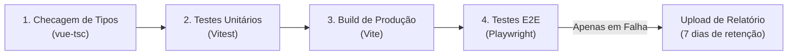

# ⚡ BaseFront — Template Base Vue 3 + TypeScript

Um template inicial (starter kit) moderno, modular e pronto para produção, construído com **Vue 3**, **Vite**, **TypeScript**, **Vue Router 4**, **Pinia** e **Axios**.

Projetado para servir como alicerce arquitetural para qualquer nova aplicação SPA (*Single Page Application*), evitando a necessidade de reconfigurar roteamento, gerenciamento de estado, autenticação e clientes HTTP do zero a cada novo projeto.

---

## 🚀 Tecnologias e Ferramentas

* **[Vue 3](https://vuejs.org/)** (v3.5+) — Framework reativo utilizando Composition API com a sintaxe `<script setup>`.
* **[Vite](https://vite.dev/)** — Ferramenta de build de ultra performance e Hot Module Replacement (HMR) instantâneo.
* **[TypeScript](https://www.typescriptlang.org/)** — Tipagem estrita em toda a base de código com checagem incremental via `vue-tsc`.
* **[Vue Router 4](https://router.vuejs.org/)** — Roteamento com suporte a code-splitting (lazy-loading), metadados tipados e guardas de navegação.
* **[Pinia](https://pinia.vuejs.org/)** — Gerenciador de estado global oficial do Vue 3, estruturado no padrão moderno de *Setup Stores*.
* **[pinia-plugin-persistedstate](https://prazdevs.github.io/pinia-plugin-persistedstate/)** — Sincronização e persistência seletiva de estado no `localStorage`.
* **[Axios](https://axios-http.com/)** — Cliente HTTP centralizado com interceptors de token e tratamento unificado de erros.
* **[Vitest](https://vitest.dev/)** — Framework de testes unitários e de componentes de alta performance integrado nativamente ao Vite.
* **[@vue/test-utils](https://test-utils.vuejs.org/)** — Biblioteca oficial de utilitários para montagem e testes de componentes Vue 3.
* **[happy-dom](https://github.com/capricorn86/happy-dom)** — Emulação leve e ultrarrápida do ambiente DOM para execução ágil de testes.
* **[Playwright](https://playwright.dev/)** — Framework moderno para testes End-to-End (E2E) com suporte a múltiplos navegadores, execução paralela e modo interativo (UI/Codegen).

---

## 📁 Arquitetura de Pastas

A estrutura dentro de `src/` segue princípios de responsabilidade única e escalabilidade:

```text
src/
├── api/                  # Camada de rede e comunicação HTTP
│   ├── client.ts         # Instância centralizada do Axios com configuração padronizada
│   ├── githubService.ts  # Exemplo de consumo de API externa (GitHub pública)
│   └── techService.ts    # Serviço de tecnologias e recursos (Mock ou API real)
├── assets/               # Recursos estáticos globais e estilos
│   ├── base.css          # Reset de CSS e variáveis de cores (temas claro/escuro)
│   ├── main.css          # Estilos globais e regras de transição de tela
│   └── logo.svg          # Logotipo vetorial da aplicação
├── components/           # Componentes reutilizáveis
│   ├── common/           # Elementos da interface (BaseCarousel, GitHubProfileCard, botões)
│   │   └── __tests__/    # Testes unitários e de comportamento dos componentes
│   └── feedback/         # Alertas, spinners, modais de diálogo e toasts
├── composables/          # Funções de lógica reutilizável (Composition API)
├── layouts/              # Cascas visuais da aplicação
│   └── DefaultLayout.vue # Layout padrão (com navbar responsiva, container e footer)
├── router/               # Configuração e guardas do Vue Router
│   ├── index.ts          # Instância do router, scrollBehavior e navigation guards
│   └── routes.ts         # Mapeamento e declaração de todas as rotas
├── stores/               # Gerenciamento de estado global com Pinia
│   ├── index.ts          # Inicialização e registro de plugins do Pinia
│   └── theme.ts          # Store de tema (claro, escuro ou sistema)
├── types/                # Definições de interfaces e modelos TypeScript
│   ├── api.ts            # Tipagens de respostas e erros HTTP genéricos
│   ├── github.ts         # Modelo da resposta da API pública do GitHub
│   ├── router.d.ts       # Extensão de tipos dos metadados de rotas (RouteMeta)
│   └── tech.ts           # Interface dos recursos e módulos tecnológicos
├── utils/                # Funções utilitárias puras (formatadores, máscaras, datas)
├── views/                # Páginas/Telas associadas às rotas
│   ├── HomeView.vue      # Página inicial com Hero, foto, vitrine de recursos e testes
│   ├── AboutView.vue     # Página informativa sobre a stack
│   └── NotFoundView.vue  # Tela 404 para rotas inexistentes
├── App.vue               # Componente raiz com DefaultLayout e IntroSplash
├── env.d.ts              # Tipagem estrita de variáveis de ambiente Vite
└── main.ts               # Ponto de entrada da aplicação (bootstrap)
```

---

## ⚙️ Principais Funcionalidades

### 1. Layout Centralizado e Transições de Rota
A aplicação utiliza uma estrutura visual unificada e limpa:

1. O layout principal [`src/layouts/DefaultLayout.vue`](file:///Users/taliberti/Development/Personal/basefront/src/layouts/DefaultLayout.vue) engloba o `router-view` em [`src/App.vue`](file:///Users/taliberti/Development/Personal/basefront/src/App.vue), fornecendo cabeçalho, navegação com alternância de tema e rodapé consistente em todas as páginas.
2. Transições suaves em animação fade (`mode="out-in"`) são aplicadas entre as trocas de página.

### 2. Navegação e Guardas de Rota (*Navigation Guards*)
Em [`src/router/index.ts`](file:///Users/taliberti/Development/Personal/basefront/src/router/index.ts):
* **Título Dinâmico da Aba**: O título do documento (`document.title`) é atualizado automaticamente baseado no `to.meta.title`.
* **Scroll Inteligente**: Toda navegação retorna ao topo (`top: 0`), preservando a posição anterior ao clicar no botão "Voltar" do navegador.

### 3. Gerenciamento de Estado Global (Pinia)
Construído com o padrão **Setup Store** (Composition API):

* **`useThemeStore`** ([`src/stores/theme.ts`](file:///Users/taliberti/Development/Personal/basefront/src/stores/theme.ts)):
  * Permite alternar entre os temas `light`, `dark` e `system`.
  * Injeta a classe `.dark` e o atributo `data-theme="dark"` no elemento raiz `<html>`.
  * Ouve automaticamente preferências do sistema operacional caso esteja em modo `system`.
  * **Persistência Local**: Salva o tema escolhido no `localStorage` via plugin `pinia-plugin-persistedstate`.

### 4. Camada HTTP Profissional (Axios)
Configurada em [`src/api/client.ts`](file:///Users/taliberti/Development/Personal/basefront/src/api/client.ts) e desacoplada em serviços:

* **Cliente Dedicado**: Instância própria com `baseURL`, `timeout` configurado e cabeçalhos padrão.
* **Modo Mock / Backend Real**: O serviço [`src/api/techService.ts`](file:///Users/taliberti/Development/Personal/basefront/src/api/techService.ts) possui uma chave seletora via variável de ambiente. Em desenvolvimento local, ele simula dados com delay assíncrono. Em ambiente conectado, consome APIs reais sem alterar componentes.

---

## 🔐 Variáveis de Ambiente

As variáveis de ambiente são tipadas em [`env.d.ts`](file:///Users/taliberti/Development/Personal/basefront/env.d.ts) para fornecer autocompletion seguro no TypeScript.

Consulte o arquivo [`.env.example`](file:///Users/taliberti/Development/Personal/basefront/.env.example):

| Variável | Tipo | Descrição | Exemplo Padrão |
| :--- | :--- | :--- | :--- |
| `VITE_APP_TITLE` | `string` | Nome exibido na aba do navegador | `"BaseFront Template"` |
| `VITE_API_BASE_URL` | `string` | Endereço base da API backend | `"https://api.exemplo.com/v1"` |
| `VITE_USE_MOCK_API` | `string` | Ativa simulação local (`"true"`) ou chamadas reais (`"false"`) | `"true"` |

> **Nota de Segurança:** O arquivo `.env` está registrado no `.gitignore` para impedir que credenciais e chaves secretas sejam enviadas ao repositório Git.

---

## 🛠️ Como Rodar o Projeto

### Pré-requisitos
* **Node.js**: Versão `^22.18.0` ou `>=24.12.0`
* **Gerenciador de Pacotes**: `npm` (ou `pnpm` / `yarn`)

### Instalação

1. Clone o repositório ou use este projeto como base:
   ```bash
   git clone <url-do-repositorio> meu-novo-projeto
   cd meu-novo-projeto
   ```

2. Instale as dependências:
   ```bash
   npm install
   ```

3. Crie o arquivo de configuração local a partir do exemplo:
   ```bash
   cp .env.example .env
   ```

4. Inicie o servidor de desenvolvimento:
   ```bash
   npm run dev
   ```
   Acesse a aplicação no navegador em: `http://localhost:5173`

---

## 📦 Scripts Disponíveis

| Comando | Descrição |
| :--- | :--- |
| `npm run dev` | Inicia o servidor de desenvolvimento com Hot Module Replacement (HMR) |
| `npm run build` | Executa a checagem de tipos (`vue-tsc`) e gera o bundle de produção na pasta `dist/` |
| `npm run preview` | Inicia um servidor local para testar o resultado do build de produção |
| `npm run type-check` | Executa apenas a verificação estrita de tipos do TypeScript sem gerar arquivos |
| `npm run test` | Executa a suíte de testes unitários e de componentes com o Vitest |
| `npm run test:watch` | Executa o Vitest em modo interativo (reexecuta testes instantaneamente ao salvar arquivos) |
| `npm run test:e2e` | Executa os testes de ponta a ponta (E2E) com o Playwright em modo headless |
| `npm run test:e2e:ui` | Abre a interface gráfica interativa (UI Mode) do Playwright para inspeção e depuração visual |

---

## 📖 Guia Prático: Como Adicionar Novas Funcionalidades

### 1. Como Criar uma Nova Página e Rota

1. Crie o arquivo da tela em `src/views/` (ex: `src/views/DashboardView.vue`):
   ```vue
   <script setup lang="ts">
   // Lógica do componente
   </script>

   <template>
     <div class="dashboard-view">
       <h1>Meu Painel</h1>
     </div>
   </template>
   ```

2. Registre a rota em [`src/router/routes.ts`](file:///Users/taliberti/Development/Personal/basefront/src/router/routes.ts):
   ```typescript
   {
     path: '/dashboard',
     name: 'dashboard',
     component: () => import('@/views/DashboardView.vue'),
     meta: {
       title: 'Painel',
       layout: 'default',   // Escolha entre: 'default', 'auth' ou 'blank'
       requiresAuth: true,  // Defina como true para proteger a rota
     },
   }
   ```

---

### 2. Como Criar uma Nova Store (Pinia)

Crie um arquivo em `src/stores/` (ex: `src/stores/cart.ts`):

```typescript
import { ref, computed } from 'vue'
import { defineStore } from 'pinia'

export const useCartStore = defineStore(
  'cart',
  () => {
    // State
    const items = ref<string[]>([])

    // Getter
    const totalItems = computed(() => items.value.length)

    // Action
    function addItem(item: string) {
      items.value.push(item)
    }

    return { items, totalItems, addItem }
  },
  {
    persist: true, // Salva automaticamente no localStorage
  }
)
```

---

### 3. Como Criar um Novo Serviço de API

Crie um arquivo em `src/api/` (ex: `src/api/productService.ts`):

```typescript
import apiClient from './client'

export interface Product {
  id: number
  title: string
  price: number
}

export const productService = {
  async getAll(): Promise<Product[]> {
    const response = await apiClient.get<Product[]>('/products')
    return response.data
  },

  async getById(id: number): Promise<Product> {
    const response = await apiClient.get<Product>(`/products/${id}`)
    return response.data
  },

  async create(data: Omit<Product, 'id'>): Promise<Product> {
    const response = await apiClient.post<Product>('/products', data)
    return response.data
  },
}

export default productService
```

---

### 4. Como Conectar ao seu Backend Real

Quando o seu servidor backend estiver pronto:
1. Abra o arquivo [`.env`](file:///Users/taliberti/Development/Personal/basefront/.env);
2. Altere a URL da API para o endereço do seu servidor:
   ```env
   VITE_API_BASE_URL="http://localhost:3000/api"
   ```
3. Mude a flag de simulação para `false`:
   ```env
   VITE_USE_MOCK_API="false"
   ```

A partir desse momento, todas as chamadas de login e requisições passarão a se comunicar com seu servidor real através da internet, injetando cabeçalhos de autenticação e tratando respostas 401 automaticamente.

---

### 5. Como Criar e Executar Testes de Componentes

Os testes são implementados utilizando **Vitest** e **@vue/test-utils** com emulação de DOM via **happy-dom**:

1. Crie o arquivo `.spec.ts` na pasta `__tests__/` ao lado do componente (ex: `src/components/common/__tests__/MeuComponente.spec.ts`):
   ```typescript
   import { describe, it, expect, vi } from 'vitest'
   import { mount, flushPromises } from '@vue/test-utils'
   import MeuComponente from '../MeuComponente.vue'

   describe('MeuComponente.vue', () => {
     it('deve renderizar o título passado por prop', () => {
       const wrapper = mount(MeuComponente, {
         props: { title: 'Olá Mundo' }
       })

       expect(wrapper.text()).toContain('Olá Mundo')
     })
   })
   ```

2. Execute os testes no terminal:
   ```bash
   npm run test        # Executa todos os testes e exibe o relatório
   npm run test:watch  # Modo contínuo (reexecuta instantaneamente ao salvar arquivos)
   ```

---

### 6. Como Criar e Executar Testes End-to-End (Playwright)

Os testes E2E rodam no navegador real (Chromium) para validar jornadas completas do usuário (roteamento, persistência de dados no `localStorage`, troca de layouts e alternância de temas):

#### Como executar os testes:
```bash
# Execução rápida no terminal (headless)
npm run test:e2e

# Execução com Interface Gráfica interativa (UI Mode com Time Travel e inspeção de DOM)
npm run test:e2e:ui

# Abrir o relatório visual HTML da última execução
npx playwright show-report
```

#### Como gravar novos testes como uma "Macro" (Codegen):
O Playwright possui um gerador de código que permite gravar suas ações no navegador e gerar o código de teste automaticamente:

1. Inicie o servidor da aplicação em um terminal (`npm run dev`);
2. Em outro terminal, execute o gravador:
   ```bash
   npx playwright codegen http://localhost:5173
   ```
3. Uma janela do navegador e a janela do **Playwright Inspector** serão abertas lado a lado.
4. Conforme você clica nos botões, digita nos formulários e navega pelas páginas, o Playwright vai **escrevendo o código TypeScript em tempo real**.
5. Ao terminar, copie o código gerado e salve em um novo arquivo dentro da pasta `e2e/` (ex: `e2e/login.spec.ts`).

*(Alternativamente, dentro do `npm run test:e2e:ui`, você pode clicar no botão **"Record new"** no topo da tela para gravar ações diretamente pela interface gráfica).*

---

## 🔄 Integração Contínua (CI/CD — GitHub Actions)

O projeto conta com uma pipeline automatizada via **GitHub Actions** em [`.github/workflows/ci.yml`](.github/workflows/ci.yml), executada a cada `push` ou `pull_request` nas branches `master` e `main`:



### Etapas da Pipeline:
1. **Ambiente e Dependências:** Prepara o ambiente com Node.js 22, cache nativo de dependências (`cache: 'npm'`) e instalação reproduzível via `npm ci`.
2. **Checagem de Tipos:** Executa `npm run type-check` com `vue-tsc` para impedir código com inconsistências de tipo no repositório.
3. **Testes Unitários e Componentes:** Roda toda a suíte de testes do Vitest com Happy DOM (`npm test`).
4. **Build de Produção:** Valida a geração dos bundles e assets estáticos (`npm run build`).
5. **Testes End-to-End:** Instala o Chromium headless e executa as jornadas de ponta a ponta do Playwright (`npm run test:e2e`).
6. **Armazenamento Inteligente:** O relatório completo de testes só é salvo como artefato caso ocorra alguma falha (`if: failure()`), com auto-expiração em **7 dias**, garantindo custo zero e evitando consumo desnecessário da cota do GitHub.
7. **Cancelamento Automático:** Commits adicionais no mesmo Pull Request cancelam execuções anteriores ainda em andamento (`cancel-in-progress: true`), economizando minutos de máquina.

---

## 📄 Licença

Este projeto foi feito pelo Taliberti e é disponibilizado como template livre para uso pessoal e comercial sob a licença [MIT](https://opensource.org/licenses/MIT).
